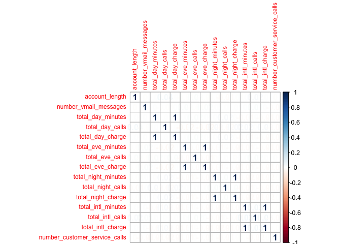
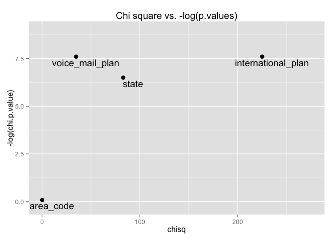
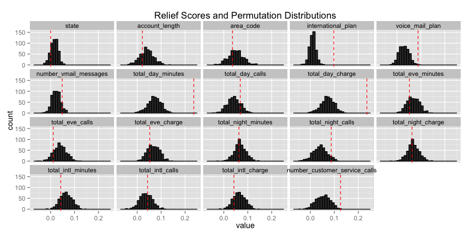

# Ex18.1 - Measuring predictor importance: churn data set
Oisin Fitzgerald  

The “churn” data set was developed to predict telecom customer churn based on 
information about their account. It contains 20 variables, with the 19
predictors including continuous and factor variables that describe an individual
account. The response churn has two levels "yes" and "no". This script demonstrates
methods for examining categorical and continuous predictor importance for 
classification problems.

(a) Examining the correlation between predictors
------------------------------------------------

```r
# load packages
library(AppliedPredictiveModeling)
library(C50)
library(corrplot)
library(caret)
```

```
## Loading required package: lattice
## Loading required package: ggplot2
```

```r
library(CORElearn)
library(ggplot2)
library(pROC)
```

```
## Type 'citation("pROC")' for a citation.
## 
## Attaching package: 'pROC'
## 
## The following objects are masked from 'package:stats':
## 
##     cov, smooth, var
```

```r
# load data
data(churn)
str(churnTrain)
```

```
## 'data.frame':	3333 obs. of  20 variables:
##  $ state                        : Factor w/ 51 levels "AK","AL","AR",..: 17 36 32 36 37 2 20 25 19 50 ...
##  $ account_length               : int  128 107 137 84 75 118 121 147 117 141 ...
##  $ area_code                    : Factor w/ 3 levels "area_code_408",..: 2 2 2 1 2 3 3 2 1 2 ...
##  $ international_plan           : Factor w/ 2 levels "no","yes": 1 1 1 2 2 2 1 2 1 2 ...
##  $ voice_mail_plan              : Factor w/ 2 levels "no","yes": 2 2 1 1 1 1 2 1 1 2 ...
##  $ number_vmail_messages        : int  25 26 0 0 0 0 24 0 0 37 ...
##  $ total_day_minutes            : num  265 162 243 299 167 ...
##  $ total_day_calls              : int  110 123 114 71 113 98 88 79 97 84 ...
##  $ total_day_charge             : num  45.1 27.5 41.4 50.9 28.3 ...
##  $ total_eve_minutes            : num  197.4 195.5 121.2 61.9 148.3 ...
##  $ total_eve_calls              : int  99 103 110 88 122 101 108 94 80 111 ...
##  $ total_eve_charge             : num  16.78 16.62 10.3 5.26 12.61 ...
##  $ total_night_minutes          : num  245 254 163 197 187 ...
##  $ total_night_calls            : int  91 103 104 89 121 118 118 96 90 97 ...
##  $ total_night_charge           : num  11.01 11.45 7.32 8.86 8.41 ...
##  $ total_intl_minutes           : num  10 13.7 12.2 6.6 10.1 6.3 7.5 7.1 8.7 11.2 ...
##  $ total_intl_calls             : int  3 3 5 7 3 6 7 6 4 5 ...
##  $ total_intl_charge            : num  2.7 3.7 3.29 1.78 2.73 1.7 2.03 1.92 2.35 3.02 ...
##  $ number_customer_service_calls: int  1 1 0 2 3 0 3 0 1 0 ...
##  $ churn                        : Factor w/ 2 levels "yes","no": 2 2 2 2 2 2 2 2 2 2 ...
```

```r
# correlation between the continuous variables the the 
numeric_vars <- sapply(churnTrain, is.numeric)
corrs <- cor(churnTrain[numeric_vars])
corrplot(corrs, method = "number", tl.cex = 0.75)
```

 

Finding a perfect colinearity between the of four pairs of total charge and 
total minutes variables is of course no surprise, phone charges are set per time 
period! However it is somewhat surprising that there is no linear relation 
between any other pairs of variables. A scatterplot matrix of a subset of 
the continuous variables reveals the extent of any pairwise relationship and 
how certain variables contain numerous of zeros.

 

(b) Assessing the importance of categorical predictors
-------------------------------------------------------------------------------
Odds ratios, Fisher's exact test and chi-square tests provide methods to examine 
the extent of association between factor levels and the response categories. 
Fisher's exact test is considred more reliable than chi-square, however it is more
computationally intensive.

```r
# A function to calculate chi-square, odds ratios and fisher's exact test
association_tests <- function(x, y) { # x is predictors, y is response
  
  x <- x[ ,sapply(x, is.factor)]
  n <- length(x)
  names <- colnames(x)

  out <- data.frame(
    chisq = rep(NA, n), 
    chi.p.value = rep(NA, n), 
    odds.ratio = rep(NA, n), 
    fisher.p.value = rep(NA, n))

  for (i in 1:n) {
    row.names(out)[i] <- names[i]
    if (nlevels(x[ ,i]) > 7) {
      fish_res <- fisher.test(x = x[ ,i], y = y, simulate.p.value = TRUE)
      out$fisher.p.value[i] <- fish_res$p.value
    } else {
      fish_res <- fisher.test(x = x[ ,i], y = y)
      out$fisher.p.value[i] <- fish_res$p.value
      if (nlevels(x[ ,i]) <= 2) out$odds.ratio[i] <- fish_res$estimate
      }
    
    chi_res <- chisq.test(x = x[ ,i], y = y, simulate.p.value = TRUE) # chisq test
    out$chisq[i] <- chi_res$statistic
    out$chi.p.value[i] <- chi_res$p.value
  }
  out
}

res <- association_tests(x = churnTrain[ ,1:19], y = churnTrain$churn)
```

The results suggest international plan to be an important variable, while area code 
shows little value as a predictor. The extremely low chi-square statistic and 
high p-value suggests data may have been purposely balanced by area code. Voice 
mail plan and state seems to have value, without the same strngth of association
as international plan.

```r
ggplot(data = res, aes(x = chisq, y = -log(chi.p.value))) + 
  geom_point(size = 3) +
  annotate("text", x = res$chisq + 10, 
    y = -log(res$chi.p.value) -.3, label = c(row.names(res))) +
  labs(title = "Chi square vs. -log(p.values)") +
  xlim(NA, 275) + ylim(NA, 9)
```

 
Receiver operating characteristic (ROC) curves offer a method to examine the extent
to which a predictor variable distinguishes between the two levels of a response
factor, e.g. to what extent does the "account_length" variable allow us to 
distinguish between customers likely to churn, and those who are not. The area 
under the ROC curve (AUC) quantifies the ability of a predictor variable to separate
between classes. 
The AUC leads to different conclusions to the association tests, with international
plan now considered the least important variable. Area code is now ranked the second
most important variable.  

```r
# Calculate the area under the ROC curve
factor_pred <- churnTrain[ ,sapply(churnTrain, is.factor)]  # subset the factors
factor_pred$churn <- NULL
auc_factors <- filterVarImp(y = churnTrain$churn, x = factor_pred)
# variables ranked by auc
auc_factors[order(auc_factors$yes, decreasing = TRUE), ]  
```

```
##                          yes        no
## voice_mail_plan    0.5649036 0.5649036
## area_code          0.4975435 0.4975435
## state              0.4947913 0.4947913
## international_plan 0.3908096 0.3908096
```

(b) Assessing the importance of continuous predictors
-------------------------------------------------------------------------------

```r
# create a subset of the continuous predictors 
cont_pred <- churnTrain[ ,sapply(churnTrain, is.numeric)]
```

Where the response is a category with two outcomes, t-tests can be used to assess
the difference in the distributions of the continuous predictors by the response
categories. As a signal/noise ratio the t-statistic quantifies the separation in
the distributions, with the associated p value indicating the extent to which this
would occur based on an assumption of no differnce.

```r
get_tstats <- function(x, y) {
  test <- t.test(x ~ y)  # Welch's t test
  out <- c(t_stat = test$statistic, p = test$p.value)
  out
}

t_values <- apply(cont_pred, MARGIN = 2, FUN = get_tstats, y = churnTrain$churn)
t_values <- data.frame(t(t_values))  # transpose
round(t_values[order(t_values$p), ], 6)
```

```
##                                t_stat.t        p
## total_day_minutes              9.684563 0.000000
## total_day_charge               9.684476 0.000000
## number_customer_service_calls  8.955141 0.000000
## number_vmail_messages         -5.821254 0.000000
## total_eve_minutes              5.272354 0.000000
## total_eve_charge               5.271986 0.000000
## total_intl_charge              3.939933 0.000090
## total_intl_minutes             3.938851 0.000091
## total_intl_calls              -2.960420 0.003186
## total_night_charge             2.171007 0.030272
## total_night_minutes            2.170889 0.030280
## total_day_calls                1.002387 0.316543
## account_length                 0.961889 0.336458
## total_eve_calls                0.537389 0.591180
## total_night_calls              0.348818 0.727339
```

The AUC and t-test for the continuous predictors both agree to a large extent.
They share the same top 3 predictors, and only seem to have slight re-shuffling 
otherwise.

```r
# Calculate the area under the ROC curve
auc_numeric <- filterVarImp(y = churnTrain$churn, x = cont_pred)
# continuous variables ranked by AUC
auc_numeric[order(auc_numeric$yes, decreasing = TRUE), ]  
```

```
##                                     yes        no
## total_day_minutes             0.6399666 0.6399666
## total_day_charge              0.6399666 0.6399666
## number_customer_service_calls 0.6082071 0.6082071
## total_eve_minutes             0.5726508 0.5726508
## total_eve_charge              0.5726417 0.5726417
## number_vmail_messages         0.5616465 0.5616465
## total_intl_calls              0.5606302 0.5606302
## total_intl_minutes            0.5498979 0.5498979
## total_intl_charge             0.5498979 0.5498979
## total_night_charge            0.5281719 0.5281719
## total_night_minutes           0.5281632 0.5281632
## total_day_calls               0.5215742 0.5215742
## account_length                0.5127787 0.5127787
## total_eve_calls               0.5070339 0.5070339
## total_night_calls             0.4961509 0.4961509
```


(d) Use RefliefF to jointly assess the importance of predictors
-------------------------------------------------------------------------------
The Relief algorithm is another method to measure the importance of predictors
for a two class response problem (although it can deal with other situations
as well). It begins by randomly selecting a set of observations, R, of size m. 
The algorithm then evaluates each predictor in isolation by looping through each 
point in the random set and for each point (1) finding the two nearest scores 
that are a hit(i.e. share same class in response) and a miss (i.e. does not share 
same class in reponse) and (2) updating the score for that predictor, 
S = S - diff(R, Hit)^2/m + diff(R, Miss)^2/m.

```r
relief_values <- attrEval(churn ~ ., data = churnTrain,
  estimator = "ReliefFequalK",  # calculation method
  ReliefIterations = 50)  # num iteration
relief_values[order(relief_values, decreasing = TRUE)]
```

```
##             total_day_minutes              total_day_charge 
##                    0.22143292                    0.22139392 
## number_customer_service_calls            total_night_charge 
##                    0.18800000                    0.09831919 
##           total_night_minutes             total_night_calls 
##                    0.09818469                    0.08303286 
##             total_intl_charge            total_intl_minutes 
##                    0.07882716                    0.07866667 
##            international_plan               voice_mail_plan 
##                    0.07400000                    0.06600000 
##              total_intl_calls             total_eve_minutes 
##                    0.05766667                    0.04848208 
##              total_eve_charge               total_day_calls 
##                    0.04847234                    0.04836364 
##                     area_code                         state 
##                    0.04000000                    0.03800000 
##         number_vmail_messages               total_eve_calls 
##                    0.03406536                    0.03066667 
##                account_length 
##                    0.02812672
```

An addition to the Relief algorithm is to permutate the response observations so as to 
gain an understanding of the predictors score when it has no relevance. This method, 
called ReliefF, can be iterated several times giving a somewhat normal distribution of scores that can then be compared to the true Relief score in terms of standard
deviations. This indicates how much greater the Relief score is than what could 
be expected by chance alone. 

```r
relief_perm <- permuteRelief(x = churnTrain[ ,-20], y = churnTrain$churn, nperm = 500,
  estimator = "ReliefFequalK",
  ReliefIterations = 50)
```

The results suggest that total day charge (and therefore total day minutes - 
one is a multiple of the other) and number of customer service calls are highly
important variables. International plan is also quite far from its permutation
distribution mean in terms of standard deviations, putting this method more in
agreement with chisq/fishers than the AUC. However its relief score still quite
low. This may be a result of a heavy bias towards "no" internation plan and "no" 
churn but ambiguity otherwise (poor sensitivity -> low AUC curve?). There are several predictors that appear without value including state, area code, total intl minutes (and charges), and total night minutes (and charges).

```r
# Histograms of the permutated relief scores
relief_values <- data.frame(Predictor = names(relief_values), 
  value = relief_values, 
  row.names = NULL)
ggplot(data = relief_perm$permutations, aes(x = value)) + 
  geom_histogram(binwidth = .01, colour = 1) +
  geom_vline(aes(xintercept = value), relief_values, colour = "red", linetype = 2) +
  facet_wrap(~ Predictor) + 
  labs(title = "Relief Scores and Permutation Distributions", xlab = "Relief Scores")
```

 

```r
# Standard deviation of permutated distribution from non-permutated score
relief_perm$standardized[order(relief_perm$standardized)]
```

```
##            total_intl_minutes             total_intl_charge 
##                    -1.2937562                    -1.2821317 
##                     area_code              total_intl_calls 
##                    -0.5042796                    -0.4506004 
##                         state               total_day_calls 
##                    -0.4283967                     0.1316824 
##              total_eve_charge             total_eve_minutes 
##                     0.1846485                     0.1855189 
##           total_night_minutes            total_night_charge 
##                     0.3908771                     0.3917792 
##                account_length             total_night_calls 
##                     0.4028454                     0.7952273 
##               total_eve_calls number_customer_service_calls 
##                     0.8226686                     3.2901295 
##         number_vmail_messages               voice_mail_plan 
##                     3.5356765                     5.4117153 
##            international_plan             total_day_minutes 
##                     7.7982794                     7.9345573 
##              total_day_charge 
##                     7.9358552
```


